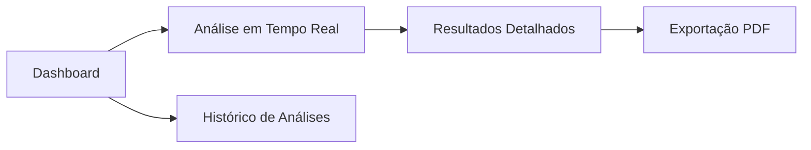

# 🔬 PatoIA - Interface para Análise de Glomérulos Renais


O **PatoIA** é uma plataforma inteligente desenvolvida para o **Hackathon UNESP Nefrologia 4.0**, focada na automação da análise histológica de glomérulos renais. Utilizando inteligência artificial, o sistema identifica, classifica e analisa o nível de maturação patológica em imagens de alta resolução (SVS).

---

## 🚀 Funcionalidades Principais

- **🔍 Identificação Automática**: Detecção precisa de glomérulos em cortes seccionais de imagens histológicas.
- **🛡️ Detecção de Esclerose**: Algoritmo especializado na identificação de esclerose glomerular.
- **📊 Classificação Dinâmica**: Separação automatizada entre glomérulos saudáveis e esclerosados.
- **📈 Análise de Maturação**: Classificação do estágio de progressão patológica em 5 níveis (Saudável, Leve, Moderada, Avançada e Severa).
- **🗺️ Visualizador Interativo**: Navegação por zoom, marcações sobrepostas e detalhes individuais de cada estrutura identificada.
- **📋 Relatórios Estatísticos**: Gráficos de distribuição e maturação para suporte à decisão clínica.
- **📄 Exportação de Dados**: Geração de relatórios em PDF com os resultados consolidados da análise.

---

## 🛠️ Tecnologias Utilizadas

O projeto foi construído com as tecnologias mais modernas do ecossistema Web:

- **Core**: [React 18](https://reactjs.org/) + [TypeScript](https://www.typescriptlang.org/)
- **Build Tool**: [Vite](https://vitejs.dev/)
- **Estilização**: [Tailwind CSS 4](https://tailwindcss.com/)
- **Componentes UI**: [Radix UI](https://www.radix-ui.com/) (base do Shadcn/UI)
- **Ícones**: [Lucide React](https://lucide.dev/)
- **Gráficos**: [Recharts](https://recharts.org/)
- **Roteamento**: [React Router 7](https://reactrouter.com/)
- **Animações**: [Framer Motion](https://www.framer.com/motion/)
- **Notificações**: [Sonner](https://sonner.emilkowal.ski/)

---

## 📂 Estrutura de Navegação



---

## 💻 Como Executar o Projeto

1. **Clone o repositório**:
   ```bash
   git clone [https://github.com/Joseesanto14/PatoIA-Analise-Glomerular---Hackathon-Unesp-Nefrologia-4.0.git]
   ```

2. **Instale as dependências**:
   ```bash
   npm install
   # ou
   pnpm install
   ```

3. **Inicie o servidor de desenvolvimento**:
   ```bash
   npm run dev
   ```

4. **Acesse no navegador**:
   O projeto estará disponível em `http://localhost:5173`.

---

## 🎨 Design

A interface foi projetada para oferecer a melhor experiência ao patologista, focando em clareza visual e facilidade de interação com dados complexos. 

O design original pode ser consultado no Figma:
[Interface para Análise de Glomérulos](https://www.figma.com/design/bwuFMnzaWblLG2izqKE0Nb/Interface-para-An%C3%A1lise-de-Glom%C3%A9rulos)

---

## 📄 Licença

Este projeto foi desenvolvido durante o Hackathon UNESP Nefrologia 4.0. Consulte os arquivos de atribuição para mais detalhes sobre bibliotecas de terceiros.

---
Desenvolvido com ❤️ para a evolução da Nefrologia Digital.
